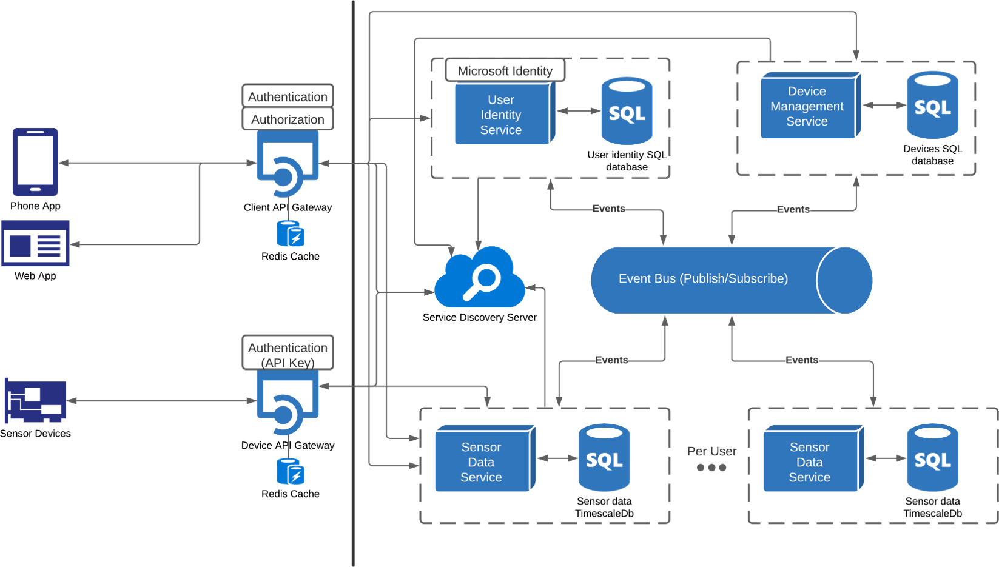

# IoT data processing system - server application and system database

## Project architecture 

## Tech stack

### Backend (Code)
- ASP.NET
- gRPC
- Entity Framework Core
### Database
- PostgreSQL
- TimescaleDB (time-series database)
### Infrastructure
- Docker (deployment & testing)
- Consul (service registration)
- RabbitMQ (communication between services)

